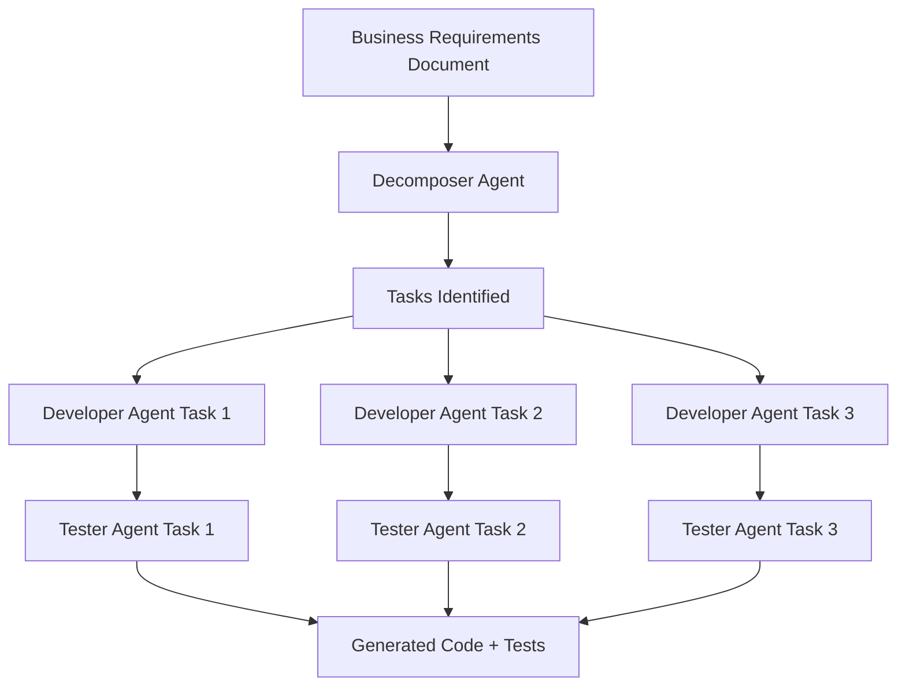

# 🚀 SprintGenie - AI-Powered Agile Development + Interview Prep Hub

[](https://www.python.org/downloads/)
[](https://github.com/openai/openai-agents-python)
[](LICENSE)
[](#)

**Two powerful tools in one repository:**
1. 🤖 Transform BRDs into production-ready code using AI agents
2. 📚 16,000+ lines of Tarento Technologies interview preparation materials

## ✨ Features

- 🤖 **Multi-Agent System**: Three specialized AI agents working together
  - **Decomposer Agent**: Breaks down BRDs into Epics, User Stories, and Tasks
  - **Developer Agent**: Generates clean, documented Python code
  - **Tester Agent**: Creates comprehensive unit tests

- ⚡ **Concurrent Processing**: All tasks processed in parallel for maximum speed
- 📁 **Organized Output**: Separate files for each task (code + tests)
- 📊 **Complete Documentation**: Summary reports with explanations
- 🎯 **Production Ready**: Professional code with type hints and best practices

## 🎬 Demo

**Input:** Business Requirements Document
```
Build a Task Management System

Features:
1. User Authentication
   - Registration with email
   - Login with JWT tokens
   
2. Task Management
   - Create tasks
   - Edit tasks
   - Delete tasks
```

**Output:** 6+ Python files
```
generated_tasks/
├── task_01_user_registration.py
├── test_task_01_user_registration.py
├── task_02_user_login.py
├── test_task_02_user_login.py
├── task_03_create_tasks.py
├── test_task_03_create_tasks.py
└── workflow_summary.md
```

## 🚀 Quick Start

### Prerequisites

- Python 3.11+
- OpenAI API Key
- UV package manager

### Installation

```bash
# Clone the repository
git clone https://github.com/yourusername/agilemaster.git
cd agilemaster

# Install dependencies
uv sync

# Set up environment variables
echo "OPENAI_API_KEY=your-key-here" > .env
```

### Usage

**Option 1: CLI Workflow (Recommended)**

1. Edit `agile_workflow.py` and update the BRD text (line ~170)
2. Run the workflow:

```bash
.venv/Scripts/python agile_workflow.py
```

3. Check `generated_tasks/` folder for output!

**Option 2: File Input**

```bash
# Create your BRD file
echo "Build your project here..." > my_project.txt

# Run the workflow
.venv/Scripts/python agile_workflow_file.py my_project.txt
```

## 📊 How It Works



**Workflow Steps:**
1. **Decomposition** (10 sec): BRD → Epics, User Stories, Tasks
2. **Development** (60-90 sec): Each task → Python code (parallel)
3. **Testing** (60-90 sec): Each code → Unit tests (parallel)
4. **Output**: Separate files + Summary report

## 💡 Example Output

### Code File: `task_01_user_registration.py`

```python
"""
Task 1
Epic: User Management
User Story: As a user, I want to register...
Task: Implement user registration functionality.
"""

def register_user(username, password, email):
    """
    Register a new user with validation.
    
    Args:
        username: Unique username
        password: User password (will be hashed)
        email: Valid email address
        
    Returns:
        Success or error message
    """
    # Implementation with validation
    ...

# Explanation:
# This code provides secure user registration with...
```

### Test File: `test_task_01_user_registration.py`

```python
"""
Unit Tests for Task 1
Task: Implement user registration functionality.
"""

import unittest

# Test Case 1: Valid registration
def test_valid_registration():
    result = register_user("john_doe", "secure123", "john@example.com")
    assert result == "User successfully registered"

# Test Case 2: Duplicate username
def test_duplicate_username():
    ...

# Coverage Summary:
# Tests cover registration, validation, error handling...
```

## 📁 Project Structure

```
Agilepilot/
├── agileagents/
│   ├── decomposer_agent.py    # BRD decomposition
│   ├── developer_agent.py     # Code generation
│   └── tester_agent.py        # Test creation
├── agile_workflow.py          # Main CLI workflow
├── agile_workflow_file.py     # File input workflow
├── developer_task_runner.py   # Simple test runner
├── sample_brd.txt             # Example BRD
├── generated_tasks/           # Output directory
└── docs/                      # Documentation
```

## ⚙️ Configuration

### Environment Variables

Create a `.env` file:

```env
OPENAI_API_KEY=your-api-key-here
```

### Customize Agents

Edit agent files in `agileagents/`:

```python
# agileagents/developer_agent.py
developer_agent = Agent(
    name="DeveloperAgent",
    instructions="Write clean, documented Python code...",
    model="gpt-4o",  # or "gpt-4o-mini" for faster/cheaper
    output_type=DevelopmentResponse
)
```

## 📊 Performance

| Project Size | Tasks | Time | Files Created |
|--------------|-------|------|---------------|
| Small        | 3-5   | ~2 min | 7-11 |
| Medium       | 5-8   | ~3 min | 11-17 |
| Large        | 8-12  | ~4 min | 17-25 |

*All tasks processed in parallel for speed*

## 🎯 Use Cases

### 1. Rapid Prototyping
Quickly generate code from client requirements for demos

### 2. Microservices Development
Create individual service implementations with tests

### 3. Learning & Education
Study well-structured code examples for different features

### 4. Code Review
Generate baseline implementations for comparison

## 🧪 Testing

The system has been tested with:
- ✅ E-commerce platforms (7 tasks, 15 files)
- ✅ Authentication systems (3 tasks, 7 files)
- ✅ CRUD operations (5 tasks, 11 files)
- ✅ API services (4 tasks, 9 files)

## 📚 Documentation

- **[Quick Start](docs/START_HERE.md)** - Get started in 3 steps
- **[Complete Guide](docs/COMPLETE_SOLUTION.md)** - Full documentation
- **[API Reference](docs/README.md)** - Detailed API docs
- **[Examples](docs/QUICK_REFERENCE.md)** - Code examples

## 🤝 Contributing

Contributions are welcome! Please feel free to submit a Pull Request.

1. Fork the repository
2. Create your feature branch (`git checkout -b feature/AmazingFeature`)
3. Commit your changes (`git commit -m 'Add some AmazingFeature'`)
4. Push to the branch (`git push origin feature/AmazingFeature`)
5. Open a Pull Request

## 🐛 Known Issues

- Gradio web interface has dependency conflicts (use CLI instead)
- Large BRDs (>10,000 words) may take longer to process
- Generated code should be reviewed before production use

## 🔮 Roadmap

- [ ] Add code review agent
- [ ] Implement database schema generation
- [ ] Add API endpoint generation
- [ ] Support for multiple languages (TypeScript, Java, etc.)
- [ ] Integration with GitHub Actions
- [ ] Web-based UI (Gradio/Streamlit)

## 📝 License

This project is licensed under the MIT License - see the [LICENSE](LICENSE) file for details.

## 🙏 Acknowledgments

- OpenAI for the Agents SDK
- The open-source community
- All contributors

## 📚 Interview Preparation Materials

### Comprehensive Tarento Technologies Interview Guide

This repository includes **16,211+ lines** of curated interview preparation content!

#### 📋 Complete Index: [INDEX.md](INDEX.md)

#### 🎯 Interview Resources:

1. **[TARENTO_VS_UST_COMPARISON.md](TARENTO_VS_UST_COMPARISON.md)** (920 lines)
   - Career comparison & interview process
   - Compensation: ₹24-36 LPA

2. **[TARENTO_BHASHINI_INTERVIEW_QUESTIONS.md](TARENTO_BHASHINI_INTERVIEW_QUESTIONS.md)** (3,033 lines)
   - Bhashini 2.0 architecture
   - API Marketplace & Partner Portal

3. **[TARENTO_CODING_QUESTIONS.md](TARENTO_CODING_QUESTIONS.md)** (2,859 lines)
   - Data structures & algorithms
   - NLP & async programming

4. **[PYTHON_ARCHITECT_QUESTIONS.md](PYTHON_ARCHITECT_QUESTIONS.md)** (3,069 lines)
   - Architectural patterns
   - System design scenarios

5. **[ARCHITECT_INTERVIEW_QUESTIONS.md](ARCHITECT_INTERVIEW_QUESTIONS.md)** (2,737 lines)
   - FastAPI & Airflow
   - API best practices

6. **[PYTHON_EVALUATION_SYSTEMS.md](PYTHON_EVALUATION_SYSTEMS.md)** (2,351 lines)
   - AI/ML evaluation
   - Testing frameworks

7. **[DEPENDENCY_INJECTION_FASTAPI.md](DEPENDENCY_INJECTION_FASTAPI.md)** (1,242 lines)
   - DI patterns
   - Multi-tenant apps

#### 📄 Convert to PDF:
**[HOW_TO_CREATE_PDFS.md](HOW_TO_CREATE_PDFS.md)** - Easy conversion guide

**Quick:** Run `open_for_pdf_conversion.bat` or use https://cloudconvert.com/md-to-pdf

---

## 📧 Contact

For questions or support, please open an issue on GitHub.

## ⭐ Star History

If you find this project useful, please consider giving it a star!

---

**Built with ❤️ using OpenAI Agents SDK**

🚀 **Transform BRDs into code** + 📚 **Ace Tarento interviews** with 16k+ lines of prep material!

