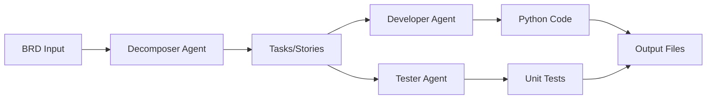

# 🚀 SprintGenie - AI-Powered Agile Development Workflow

[](https://www.python.org/downloads/)
[](https://github.com/openai/openai-agents-python)
[](LICENSE)

Transform your Business Requirements Documents (BRD) into production-ready Python code automatically using AI agents!

---

## ✨ Features

### 🤖 Multi-Agent System
Three specialized AI agents working together:

- **Decomposer Agent**: Breaks down BRDs into Epics, User Stories, and Tasks
- **Developer Agent**: Generates clean, documented Python code
- **Tester Agent**: Creates comprehensive unit tests

### ⚡ Key Capabilities

- **Concurrent Processing**: All tasks processed in parallel for maximum speed
- **Organized Output**: Separate files for each task (code + tests)
- **Complete Documentation**: Summary reports with explanations
- **Production Ready**: Professional code with type hints and best practices
- **Configurable**: Easy-to-modify agent instructions in config files

---

## 🎬 Demo

**Input:** Business Requirements Document

```
Build a Task Management System

Features:
1. User Authentication
   - Registration with email
   - Login with JWT tokens
   
2. Task Management
   - Create tasks
   - Edit tasks
   - Delete tasks
```

**Output:** 6+ Python files

```
generated_tasks/
├── task_01_user_registration.py
├── test_task_01_user_registration.py
├── task_02_user_login.py
├── test_task_02_user_login.py
├── task_03_create_tasks.py
├── test_task_03_create_tasks.py
└── workflow_summary.md
```

---

## 🚀 Quick Start

### Prerequisites

- Python 3.11+
- OpenAI API key
- `uv` package manager (recommended) or `pip`

### Installation

1. **Clone the repository:**
```bash
git clone https://github.com/RamyaGopalRao/Sprintgenie.git
cd Sprintgenie
```

2. **Install dependencies:**
```bash
# Using uv (recommended)
uv sync

# Or using pip
pip install -r requirements.txt
```

3. **Set up environment variables:**
```bash
# Create .env file
echo "OPENAI_API_KEY=your-api-key-here" > .env
```

---

## 💻 Usage

### Option 1: CLI Workflow (Recommended)

**Interactive Mode:**
```bash
python agile_workflow.py
```

Enter your BRD when prompted, and the system will generate code + tests automatically.

**File Input Mode:**
```bash
python agile_workflow_file.py sample_brd.txt
```

Use a text file containing your BRD.

---

### Option 2: Gradio Web Interface

**Simple Interface:**
```bash
python gradio_simple_workflow.py
```

Then open http://localhost:7860 in your browser.

**Features:**
- ✅ User-friendly web interface
- ✅ Real-time progress updates
- ✅ Copy/paste BRD directly
- ✅ Download generated files

---

### Option 3: File Upload Interface

```bash
python gradio_file_upload.py
```

Upload BRD as a text file through the web interface.

---

## 📁 Project Structure

```
Agilepilot/
├── agileagents/                    # Core agent modules
│   ├── decomposer_agent.py        # BRD decomposition agent
│   ├── developer_agent.py         # Code generation agent
│   └── tester_agent.py            # Test generation agent
│
├── config/                         # Agent configurations
│   ├── decomposer_instructions.txt # Decomposer guidelines
│   ├── developer_instructions.txt  # Developer guidelines
│   ├── tester_instructions.txt     # Tester guidelines
│   └── README.md                   # Config documentation
│
├── agile_workflow.py              # CLI workflow (interactive)
├── agile_workflow_file.py         # CLI workflow (file input)
├── gradio_simple_workflow.py      # Web UI (simple)
├── gradio_file_upload.py          # Web UI (file upload)
├── sample_brd.txt                 # Example BRD
├── LICENSE                        # MIT License
└── README.md                      # This file
```

---

## 🛠️ How It Works

### Workflow Pipeline



### Step-by-Step Process

1. **Input:** User provides BRD (text or file)
2. **Decomposition:** DecomposerAgent breaks BRD into:
   - Epics (high-level features)
   - User Stories (specific requirements)
   - Tasks (implementable units)

3. **Parallel Processing:**
   - DeveloperAgent generates code for each task
   - TesterAgent creates unit tests for each task

4. **Output:** Organized files:
   - `task_XX_name.py` - Implementation
   - `test_task_XX_name.py` - Unit tests
   - `workflow_summary.md` - Documentation

---

## 🎯 Use Cases

### 1. Rapid Prototyping
Transform ideas into working code in minutes.

### 2. Code Generation
Generate boilerplate code and tests automatically.

### 3. Agile Development
Accelerate sprint planning and task breakdown.

### 4. Learning Tool
See how BRDs translate into actual code.

### 5. Documentation
Generate implementation guidelines from requirements.

---

## ⚙️ Configuration

### Customizing Agent Behavior

Edit instruction files in the `config/` directory:

**`config/decomposer_instructions.txt`:**
- Modify task breakdown strategy
- Change epic/story structure
- Adjust granularity

**`config/developer_instructions.txt`:**
- Set coding standards
- Choose frameworks/libraries
- Define documentation style

**`config/tester_instructions.txt`:**
- Configure test coverage requirements
- Set testing frameworks
- Define test patterns

### Example: Change Code Style

```bash
# Edit developer instructions
nano config/developer_instructions.txt

# Add your preferred style guide
# E.g., "Follow Google Python Style Guide"
```

---

## 🎨 Example BRD

See `sample_brd.txt` for a complete example:

```text
E-Learning Platform Requirements

1. User Management
   - Students can register and create profiles
   - Instructors can apply and be approved
   - Admin can manage all users

2. Course Management
   - Instructors can create and publish courses
   - Courses have modules and lessons
   - Support for video, text, and quiz content

3. Enrollment & Progress
   - Students can enroll in courses
   - Track lesson completion
   - Certificate generation on completion
```

**Run it:**
```bash
python agile_workflow_file.py sample_brd.txt
```

---

## 📊 Performance

- **Processing Time:** ~30-60 seconds per BRD (depends on complexity)
- **Concurrent Tasks:** All tasks processed in parallel
- **Output Quality:** Production-ready code with type hints and documentation
- **Test Coverage:** Comprehensive unit tests for all functions

---

## 🧪 Testing

### Run the Test Suite

```bash
# Test the workflow
python test_workflow.py

# Test individual agents
python -m pytest agileagents/
```

### Verify Installation

```bash
# Check dependencies
uv pip list

# Verify OpenAI API key
python -c "import os; from dotenv import load_dotenv; load_dotenv(); print('API Key:', 'Set' if os.getenv('OPENAI_API_KEY') else 'Not Set')"
```

---

## 🔧 Troubleshooting

### Common Issues

**1. Import Errors**
```bash
# Reinstall dependencies
uv pip install --reinstall -r requirements.txt
```

**2. OpenAI API Errors**
```bash
# Check API key
cat .env

# Verify API key is valid
# Visit: https://platform.openai.com/api-keys
```

**3. Gradio Not Starting**
```bash
# Check if port 7860 is available
# Try different port
python gradio_simple_workflow.py --port 7861
```

**4. Empty Output**
- Ensure BRD is detailed enough
- Check agent instructions in `config/`
- Verify OpenAI API quota

---

## 📝 Contributing

Contributions are welcome! Please feel free to submit a Pull Request.

### Development Setup

```bash
# Clone the repo
git clone https://github.com/RamyaGopalRao/Sprintgenie.git
cd Sprintgenie

# Install dev dependencies
uv pip install -e ".[dev]"

# Run tests
pytest

# Format code
black .
```

---

## 🔒 License

This project is licensed under the MIT License - see the [LICENSE](LICENSE) file for details.

---

## 🙏 Acknowledgments

- **OpenAI** for the Agents SDK
- The **open-source community**
- All **contributors**

---

## 📧 Contact

For questions or support, please open an issue on GitHub.

**GitHub Repository:** https://github.com/RamyaGopalRao/Sprintgenie

---

## 🌟 Star History

If you find this project useful, please consider giving it a star! ⭐

---

**Built with ❤️ using OpenAI Agents SDK**

Transform your ideas into code with AI-powered agile workflow! 🚀
